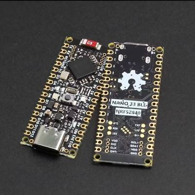
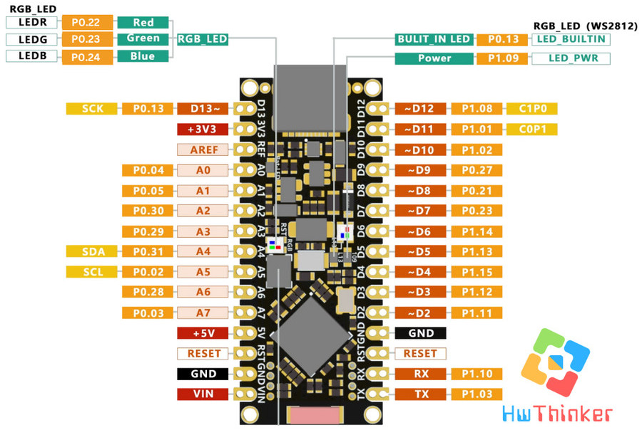
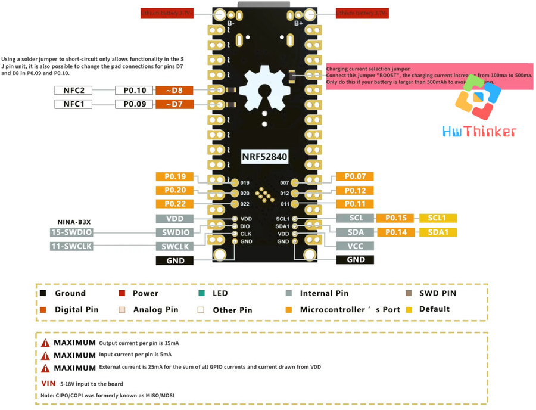
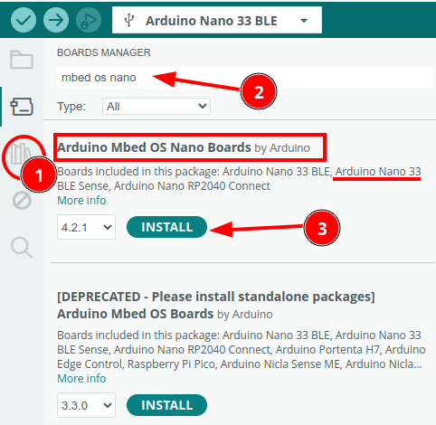
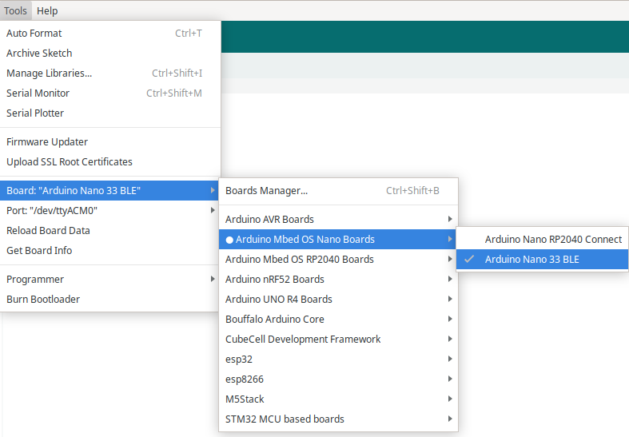
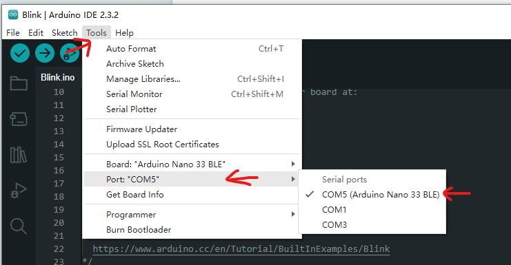
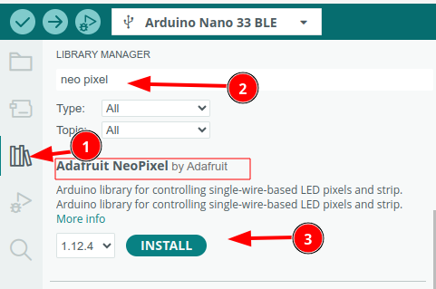

# Nologo Nano 33 BLE







> [!NOTE]
> B-: Baterai lithium 3,7V-
> B+: Baterai lithium 3,7V+
> Arus keluaran MAKSIMUM per pin adalah 15mA
> Arus masukan MAKSIMUM per pin adalah 5mA
>Arus eksternal MAKSIMUM adalah 25mA untuk total arus dari semua pin GPIO dan arus yang diambil dari VDD
>VIN: Masukan 5V ke papan
> Catatan: CIPO/COPI sebelumnya dikenal sebagai MISO/MOSI

### IO Mapping

| Arduino Pin | Definisi    | Port.Pin (nRF52840) |
| ----------- | ----------- | ------------------- |
| 13          | LED_BUILTIN | P0.13               |
| 13          | LED_WS2812  | P0.13               |
| 22          | LEDR        | P0.22               |
| 23          | LEDG        | P0.23               |
| 24          | LEDB        | P0.24               | 
| Sensor tidak tersedia | | |

Dengan informasi ini, Anda dapat langsung mengacu ke port dan pin yang sesuai untuk debugging, optimasi, atau pemrograman langsung pada chip nRF52840.


## Penggunaan Modul Nano33 BLE dengan Arduino

Untuk Menggunakan Nano33 BLE dengan arduino langkahnya sebagai berikut:

1. Download Arduino dari https://www.arduino.cc/en/software. Download yang versi MSI biar lebih mudah
2. Install Arduino
3. Install board nano 33 BLE



4.  Pilih Tools -> Board -> Arduino Mbed OS Nano Boards -> Arduino Nano 33 BLE



5. Select Port Serial




## Contoh Blinky LED WS2812 dengan ON OFF warna merah

### **Langkah-Langkah Menggunakan Program:**

1. Buat project dan isi kode berikut:


```c++
#include <Adafruit_NeoPixel.h>

// Konfigurasi pin dan jumlah LED
#define LED_PIN 13      // Pin P0.13
#define NUM_LEDS 1      // Jumlah LED WS2812 yang terhubung

// Buat objek Adafruit_NeoPixel
Adafruit_NeoPixel strip(NUM_LEDS, LED_PIN, NEO_GRB + NEO_KHZ800);

void setup() {
    // Inisialisasi NeoPixel
    strip.begin();
    strip.show(); // Matikan semua LED pada awal
}

void loop() {
    // Nyalakan LED dengan warna merah
    strip.setPixelColor(0, strip.Color(255, 0, 0)); // LED merah
    strip.show(); // Tampilkan warna
    delay(1000);  // Tunggu 1 detik

    // Matikan LED
    strip.setPixelColor(0, strip.Color(0, 0, 0)); // LED mati
    strip.show(); // Tampilkan warna
    delay(1000);  // Tunggu 1 detik
}
```

2. Install Library Neo pixel WS12812 dari adafruit



3. Compile  dan lihat hasilnya
4. Bila berhasil maka pada LED WS2812B akan blinky dengan warna merah setiap 3 detik


## Contoh Blinky pada Built IN LED Port P0.13

```c++
#include <Arduino.h>

// Pin LED yang terhubung ke P0.13
#define LED_PIN 13

void setup() {
    // Inisialisasi pin LED sebagai output
    pinMode(LED_PIN, OUTPUT);
}

void loop() {
    // Nyalakan LED
    digitalWrite(LED_PIN, HIGH);
    delay(100); // Tunggu 1 detik

    // Matikan LED
    digitalWrite(LED_PIN, LOW);
    delay(1000); // Tunggu 1 detik
}
```


## Contoh Blinky LED RGB

```c++
/*
  Exercise run on Nano 33 BLE nRF52840
  to change LEDs.
*/

// the setup function runs once when you press reset or power the board
void setup() {
  delay(1000);
  Serial.begin(9600);
  delay(500);
  Serial.print("LED_BUILTIN: ");
  Serial.println(LED_BUILTIN);
  Serial.print("LEDR: ");
  Serial.println(LEDR);
  Serial.print("LEDG: ");
  Serial.println(LEDG);
  Serial.print("LEDB: ");
  Serial.println(LEDB);

  // set LED pins to output mode
  pinMode(LEDR, OUTPUT);
  pinMode(LEDG, OUTPUT);
  pinMode(LEDB, OUTPUT);
  pinMode(LED_BUILTIN, OUTPUT);
  
  //turn off all LED
  digitalWrite(LED_BUILTIN, LOW);
  digitalWrite(LEDR, HIGH);
  digitalWrite(LEDG, HIGH);
  digitalWrite(LEDB, HIGH);
}

void changeRGB(){
  digitalWrite(LEDR, HIGH);
  digitalWrite(LEDG, HIGH);
  digitalWrite(LEDB, HIGH);
  delay(1000);

  digitalWrite(LEDR, LOW);  //LEDR On
  delay(500);

  digitalWrite(LEDR, HIGH); //LEDR Off
  digitalWrite(LEDG, LOW);  //LEDG On
  delay(500);

  digitalWrite(LEDG, HIGH); //LEDG Off
  digitalWrite(LEDB, LOW);  //LEDB On
  delay(500);

  digitalWrite(LEDB, HIGH);  //LEDB Off
}

// the loop function runs over and over again forever
void loop() {
  digitalWrite(LED_BUILTIN, LOW);   //LED_BUILTIN Off
  changeRGB();

  digitalWrite(LED_BUILTIN, HIGH);  ////LED_BUILTIN On
  changeRGB();
  
}

```

